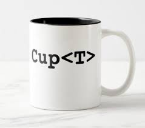
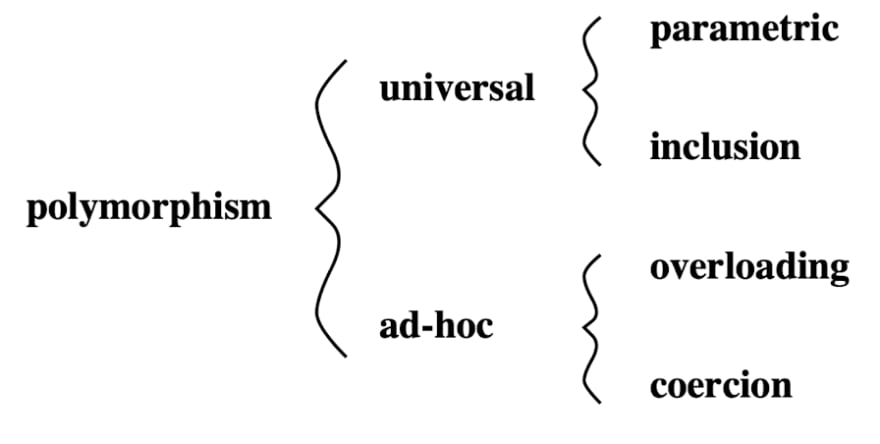
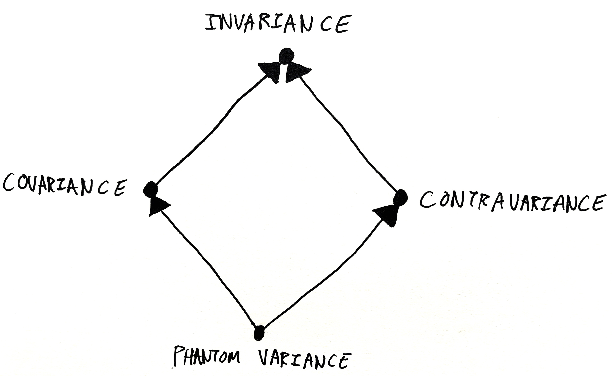

Across The Land Of Generics
===========================



Keywords: static type, type system, generics, polymorphism, software engineering
# Introduction
  Static typing is massively beneficial to the design and engineering of large systems: a good static type system can remove large
  classes of programming error before execution, clarify how pieces of a program fit together and enable fearless refactoring.
  Furthermore, type system can be more than just a safety nest: types provide "metadata" of sort to help development tools to know
  more about your code and enhance effectiveness, including smarter autocompletion engine, better suggestions from linter and even
  automated program synthesis in some case. The benefits of type systems go beyond pure programming: many approaches to
  domain-driven design also benefit from expressive type system as a *domain modeling tool*.
 
  On the other side of the spectrum, dynamic typing are generally perceived as more flexible and faster to develop with. But the
  recent trend for many dynamically typed languages in common use are gradually shifting to "parially" static type to varying
  extent: either by using optional type specs/type hints like Elixir and Python, or by creating a full-blown backward-compatible
  statically typed language for an already existing dynamic language, in the case of Typescript and Javascript. As developers and
  software engineers at zen8labs, we've experienced first-hand this transition with Python and Javascript/Typescript and can
  testify for the ergonomics and productivity improvement.
 
  On the other hand, a static type system too constrained may even reject logically correct programs. Most of the time, a too
  limiting (and limited) type system also reduces expressiveness which lead to code duplication. One proven approach to
  approximate the expressiveness of static languages to dynamic languages without sacrificing any of the benefits is to extend the
  type system with polymorphism.

# Polymorphism



  In programming context, polymorphism means a value or variable can have more than one type. According to Luca Cardelli's seminal
  papers "On Understanding Types, Abstractions and Polymorphism", there are 4 kinds of polymorphism:

  + Parametric polymorphism: type of a variable/value can be parameterized over a range of types. Also more commonly known as
  *generics*.
  + Inclusion polymorphism: types can be subtype of other types, and subtype can be used where supertype is expected. Also more
  commonly known as *inheritance* 
  + Overloading: one name/identifier can have multiple different definitions. Overloading exists in many incarnations in popular
  programming languages: overloaded methods (Java et al) and operators (C++), interface (Java et al), trait (Rust, Scala), protocol (Swift)...
  Most languages at least support some forms of numeric operator overloading, e.g. normally `+` can be applied to both floating point types
  and integral types. Sometimes `+` may even be overloaded with string concatenation too.
  + Coercion: value of a concrete type can be converted into another concrete type and used in the context of that other type.
  Most languages support at least some form of coercion between numeric types.

  The first two are also classified as *universal polymosphism*, while the last two are *ad-hoc polymorphism*
  Many popular languages have all 4 forms of polymorphism to varying extents, inducing interactions between them.
  As parametric polymorphism (generics) is the main focus of this blog post, we'll primarily explore the
  generics/overloading interactions in *type bounds* and generics/inheritance interactions in *variance*

# Generics
  Let's consider a motivating example using Golang, a major backend language in extensive use at zen8labs. Golang itself has very recently
  gone through the transition to incorporate generics into their language, so this example is gonna be something taken directly
  from production codebase. Suppose we want to write a function taking an array of string and returning the elements of that array
  satisfying a predicate:
```go
func FilterString(f func(a string) bool, amap []string) []string {
	var res []string
	for _, v := range amap {
		if f(v) {
			res = append(res, v)
		}
	}
	return res
}
```
  After a while, turns out we also need to filter array of integers too:
```go
func FilterInt(f func(a int) bool, amap []int) []int {
	var res []int
	for _, v := range amap {
		if f(v) {
			res = append(res, v)
		}
	}
	return res
}
```
  The two functions are structurally almost identical, the only difference is the type of the array's element and correspondingly
  the input type of the predicate. In fact, we can have infinitely many such structurally identical functions for infitely many
  types. What we want is a way to universally abstract this same logic over all possible types, just like the way a function universally
  abstract the same logic over all possible values of its parameters. That's where the "scientific ID" `parametric polymorphism`
  of generics came from. Consider the generic version of the `Filter` functions:
```go
func Filter[T any](f func(a T) bool, amap []T) []T {
	var res []T
	for _, v := range amap {
		if f(v) {
			res = append(res, v)
		}
	}
	return res
}
```
  A very observable change to the "monomorphic" versions is, we have `[T any]` instead of "String" and "Int" in the function name,
  and `T` now stands for the occurrences of `string`/`int` in type signatures in the function. `T` in this example is what we call
  a *type parameter*, because it is exactly like a function parameter, analoguous to how parameters are passed to functions at the
  more familiar value level. The `[T any]` construct introduces type parameter `T` to the rest of the following type signature,
  with `any` being a *type bound* or *type constraint*, which we'll explore soon after this, for now it's sufficient to read `[T
  any]` as "For all type `T` possible".

  While generics were remembered by most as being introduced by C++'s Template system in the early 90s, and later as its
  incarnation introduced in Java in 2004, the origin of generics went much further, with the term "parametric polymorphism" first
  appeared in 1967. The first programming language implemented parametric polymorphism was ML (MetaLanguage) in 1973, using the
  Hindley-Milner type system capable of *full type inference* for every definition and expression, meaning the compiler can infer
  the most general type even if your whole program never had any type annotation. This is not compatible with inheritance, so most
  modern programming languages with both generics and inheritance only restrict type inference to local variables. With full type
  inference, you can write statically typed programs without type annotations just like in dynamically typed languages.

  Function/method's type signature isn't the only place where we can introduce type variables. Most languages with generics support also
  allow type parameters in type and interface definition:
```java
public class ArrayList<E> extends AbstractList<E> implements List<E> {...}
public interface Collection<E> extends Iterable<E> {...}
```
## Parametricity
- When we have a family of structurally identical definition, we can generalize them into their generic version. It works the
  other way too: if you have a type signature of what your function/method should have, the number of possible valid
  implementations is typically restricted, since the definition must work *universally* for all possible types. Let's look at the
  `Filter` example again: it takes an array of type `T` elements, and returns an array of type `T` elements. From the
  implementor's point of view, there's no way the function can create a value of any `T` possible out of thin air, so the returned
  elements can only be a combination of the input array's elements. Or more interestingly, consider the following `Map` generic
  function: 
  ```go
  func Map[A any, B any](f func(a A) B, aArray []A) []B {
      bArray := make([]B, len(aArray))
      for k, v := range aArray {
          bArray[k] = f(v)
      }
      return bArray
  }
  ```
  This function takes a function from `A` to `B`, and an array with `A` elements, and returns an array with `B` elements. Since it
  must be universally applicable to all `A` and `B` types possible, one can only implement it by applying the function from `A` to
  `B` to some elements of `aArray` to obtain some elements of type `B` to create `bArray`.
 
  This property is called *parametricity*, and it can vastly improve reasoning and code comprehension: you can already tell a lot
  about the semantics of a piece of code just from its type signature, without even looking at its implementation. Some compilers
  even take advantage of it to do semantics preserving code transformations and optimizations.
 
  Unfortunately, if a generic piece of code also uses facilities like reflection or type casting, then parametricity is lost:
  after all if you can tell what concrete type a type parameter is at runtime, you can call the corresponding constructor to
  create new values of that type out of thin air. 

## Parametricity: the phantom type pattern
  One application of parametricity is the phantom type pattern. As the name suggest, a "phantom" type means a type parameter that
  doesn't "materialize" anywhere in the generic type's definition. Why would such a type parameter even be, well, not useless?
  Because we can use them to guarantee correctness at compile time. Consider the following Java snippet:
  ```java
  sealed interface Currency permits USD, VND {}
  final class USD implements Currency {}
  final class VND implements Currency {}
  class Money<C extends Currency> {
    public int value;
    Money(int val) {
      this.value = val;
    }
  } 

  class Main {
    public static <C extends Currency> Money<C> add(Money<C> m1, Money<C> m2) {
      Money<C> total = new Money(m1.value);
      total.value = total.value + m2.value;
      return total;
    }

    public static void main(String[] args) {
      Money<USD> fund1 = new Money<USD>(1);
      Money<USD> fund2 = new Money<USD>(2);
      Money<VND> fund3 = new Money<VND>(1000);
      System.out.println(add(fund1, fund2).value);
      //System.out.println(add(fund3, fund2).value); // compilation error
    }
  }
  ```
  In the above snippet, we modeled `Money` as a wrapped integer value. Each `Money` value realistically should have its unit in
  some `Currency`, and we encoded that using a type parameter for the `Money` class: `<C extends Currency>` (this means `Currency`
  is an upper type bound for `C`, which we'll explore in more detail in the next section). The type parameter `C` doesn't appear
  *anywhere* in the definition of `Money`, but its use is in the signature of method `add`, to guarantee by parametricity that we
  can only add the value of a `Money` to another of the same `Currency`, to obtain a new `Money` value, still of that same
  `Currency`. So it's fine to add 2 `USD` to 1 `USD` and obtain 3 `USD`, but it's not possible to "accidentally" add 2 `USD` to
  1000 `VND`, because they don't share the same unit, and you'd probably have to convert that 2 `USD` to equivalent value in `VND`
  first.

  While we can use an extra field in the `Money` class to tag each `Money` value with a particular `Currency`, this incurs non
  trivial runtime overhead, and most importantly the programmer must be mindful of checking that tag at runtime to, for example,
  prevent adding 1000 `VND` to 3 `USD` to obtain 1003 of ... something invalid, because otherwise there really aren't anything to
  prevent such operations. It's a win to have compilers able to automatically check these kinds of thing for you instead. This is
  what functional programmers mean by "making invalid states unrepresentable" by leveraging the type system, which is an
  important tenet in functional programming, but still not yet widely known outside of that circle. The example above was
  intentionally written using Java as a demonstration that at the time of writing this blog post, this is no longer an
  "impractical practice" only possible in niche languages, and we *can* already apply this tenet to improve code correctness in
  even the most widely used OOP language of them all.
## Bounds/Contraints
  Sometimes the universal restriction of parametricity can be too strict, and we might need to be able to do more interesting
  things to the generic arguments the function received. We can achieve it with *type bounds* or *type constraints*.
 
  The most commonly used kind of type bound is interface/protocol/trait implementation bound, meaning we can assert the type to be
  instantiated with the type variable must implements some overloading interface and thus the generic code can assume that type
  supports certain operations. Another common kind of bound is upper bound, where we assert the supertype the type extends. With
  these bounds, the implementation knows what operations/functions/methods can be used with the generic arguments. With different
  type systems, there may come other kinds of type bound too, like lifetime bounds in Rust, lower bound in Java or type equality
  bound in Haskell.

## Existentials/Wildcards
  Recall that type parameters are *universally quantified*: definition site of a generic value (e.g. the one who
  implemented the generic function like `Filter` above) can't assume anything about the concrete type, while usage site (e.g.
  the caller of `Filter`) decides which type to instantiate the type parameters as.
 
  Dual to this, we have *existential quantified* types, where definition site of an existentially quantified value decides which type
  to instantiate, while usage site can't assume anything. We can only claim that "there exists a type", possibly satisfies certain
  type bound.
 
  A familiar form of existentially quantified type is Java's `wildcard` (`<?>`):
  ```java
  class Main {
    public static void printList(List<Object> ls) {
      System.out.println(ls);
    }

    public static <T> void genericPrintList(List<T> ls) {
      System.out.println(ls);
    }

    public static void main(String[] args) {
      List<?> ls = Arrays.asList(1,2,3,4); // definition site decides ls's type is List<int>
      //Main.printList(ls); // failed to compile, because you can't assume the wildcard <?> as type Object
      Main.genericPrintList(ls); // ok
    }
  }
  ```
  If the phrase "for all" and "there exists" ring familiar to you, then they probably are: these terms come directly from the
  good old "for all" and "there exists" in logic. We'll come back to this later in this blog post.

## Variance: Co/Contra/Invariance


  Let's say we have an `Animal` type, with `Dog` and `Cat` as its subtypes, and we have a generic container type `Container<A>`. A
  problem arises: as we have `Dog`/`Cat` being subtypes of `Animal`, what is the right inheritance relationship between
  `Container<Dog>`/`Container<Cat>` and `Container<Animal>`? An intuitive and naive approach would be considering
  `Container<Dog>`/`Container<Cat>` also being subtypes of `Container<Animal>`, in academic jargons this kind of relationship is
  called *covariance*. As intuitive as it is, it may also unfortunately lead to inconsistency in the type system:
```java
  class Main {
    class Container<A> {
      A item;
      Container(A item) {
        this.item = item; 
      }
    }
    class Animal {...}
    class Dog extends Animal {...}
    class Cat extends Animal {...}

    public static void swapAnimalInContainer(Container<Animal> c, Animal a) {
      c.item = a;
    }

    public static void main(String[] args) {
      Container<Dog> dogContainer = new Container<Dog>(new Dog()); // initialize a Container of some Dog 
      Cat aCat = new Cat();
      // dogContainer can be used as a Container<Animal>, and aCat can be used as an Animal, resulting in a Container<Dog> with a Cat in it! 
      // without saying that *should* result in runtime exception
      swapAnimalInContainer(dogContainer, cat);
    }
  }
```
  What if we try the exact opposite of covariance (i.e. *contravariance*): making `Container<Animal>` a subtype of `Container<Dog>`/`Container<Cat>`?
```java
  class Main {
    public static void main(String[] args) {
      Container<Animal> animalContainer = new Container<Animal>(new Cat()); // initialize a Container<Animnal>, with some Cat
      Container<Dog> dogContainer = animalContainer; // because Container<Animal> is a subtype of Container<Dog>
      Dog aDog = dogContainer.item // but this item is initialized as a cat!
    }
  }
```
  This obviously still leads to type system inconsistency that in turn results in runtime exception. Curiously, in the former
  case we lose type safety under write, while in the latter case we lose type safety under read. Either way, does that mean
  there's fundamentally no inheritance relationship between generic types instantiated with types in an inheritance hierarchy
  whatsover? Not necessarily so: sometimes the only relationship we can assert between type `F<A>` and `F<B>` given `A` and `B` is
  `F<A> = F<B> iff A = B` (we call these cases *invariance*), but there are natural covariances and contravariances in everyday
  programming. In fact, many modern programming languages with both generics and inheritance also have notation to mark whether a
  generic type's type variables are covariant or contravariant w.r.t. that generic type, including but not limited to Scala,
  Kotlin, Swift and OCaml. In the coming examples we'll use Scala's syntax for similarity to Java, and its brevity in expressing
  co/contravariance: covariant mark being `+` and contravariant mark being `-`.

  First let's take another look the covariant case above. Observe that the root cause of type safety loss is the *mutation* of
  `Container<A>` values. If the type is immutable, there is no unsafe write, and we can safely use the type as being covariant in
  `A`. More concretely in Scala:
  ```scala
    class Container[+A](val item: A) {
    }

    sealed trait Animal {...}
    case class Dog extends Animal {}
    case class Cat extends Animal {}
    
    object Container {
      // compilation error: mutating immutable data
      //def swapAnimal(c: Container[Animal], a: Animal) {
      //  c.item = a 
      //}
    
      def main() {
        val dogContainer : Container[Dog] = new Container(Dog()) // initialize a Container of some Dog 
        val aCat = Cat()
        // swapAnimal(dogContainer, aCat) // compilation error: mutating immutable data
        // since it's impossible to add aCat into a Container[Dog], we can't get into the invalid state in the corresponding Java example
      }
    }
  ```
  For the contravariant case, we can't just contravariantly mark `A` as `-A` like in the covariant case, since Scala's type
  checker would complain that we are using a contravariant type parameter in covariant position. What does this even mean? To put
  it simply, a type is in covariant position when we can sort of "produce" a value of that type from the given "outer" type, e.g.
  we can get the field `val item: A` given a value of type `Container[A]`. In contrast, a type is in contravariant position when
  we can sort of "consume" a value of that type using the given "outer" type. How does a type even "consume" another type? In
  general, by using its member functions, and in an OOP setting, also by using its *methods*:
  ```scala
    class Consumer[-A] {
      def consume(a: A) {
        // do something to a 
      }
    }

    object Consumer {
      def main() {
        val animalConsumer : Consumer[Animal] = new Consumer() // initialize a Consumer[Animal]
        val dogConsumer : Consumer[Dog] = animalConsumser // since Consumer[Animal] is a subtype of Consumer[Dog]
        dogConsumer.consume(Dog())
      }
    }
  ```
  Using this same line of reasoning, we can understand why mutable generic types like `Container<A>` in the Java example must be
  invariant: the `A member` field is in covariant position, but you can consume its value by mutating it to another value, which
  should make it contravariant, so type parameter `A` must be invariant. For historical reason, `Array` and only `Array` in Java
  is covariant, which led to countless troubles in the past.

  There's one commonly arisen trouble with variance. Consider the `Container` class above, naturally we would like to have an
  `insert` method to extend a `Container` with a new element:
  ```scala
    class Container[+A](val item: A) {
      def insert[A](elem : A) : Container[A] {...} // error: contravariant type A occurs in covariant position
    }
  ```
  The problem with `insert`'s type signature is, we declared `A` as covariant, but we use `A` in contravariant position (`elem: A`).
  This is a type error for the same reason that using covariance with mutation causes type error: you can create a `Container` of
  `Dog` with a `Cat` in it. So how do we write the "simple" code of inserting a `Cat` to a `Container[Cat]` in a type consistent
  way? By clever use of type bound:
  ```scala
    class Container[+A](val item: A) {
      def insert[S :> A](elem : S) : Container[S] {...}
    }
  ```
  This method `insert` no longer consumes an `A` and return a `Container[A]`, and uses an `S` that is an upper bound (supertype)
  of `A` instead. Obviously `insert`ing a `Cat` to a `Container[Cat]` is allowed, but now if you try to `insert` a `Dog` to a
  `Container[Cat]`, the type system would infer `S` to be `Animal`, since `Animal` is a supertype of `Cat` and a `Dog` is an
  `Animal`. The result is then a `Container[Animal]`, so type safety is still guaranteed.

  In some languages with the so-called use site variance annotation like Java, we can only specify variance at method definition
  (since generic classes and interfaces don't have a way to annotate variance) using bounded wildcard, like the signature of the
  standard library method `Collection.addAll`: `public static <T> boolean addAll(Collection<? super T> c, T... elements)`. It's
  not as clean and succinct as the analogous method in Scala, but their goals coincided: you won't find yourself inserting a `Cat`
  into a `Collection<Dog>`, but instead a `Collection` of some unknown supertype of `Cat`. 

  If everything in this section about variance seems complex or even convoluted, it's probably because it genuinely and inherently
  is. The interplay between generics and inheritance is among the most complex features of mainstream programming languages. As
  intimidating as the variances are, understanding them would entail a deeper appreciation of relations between types
  (sub/supertype relations in OOP languages for example) and help us developers write code that are both more expressive and type
  safe.

  The astute readers might have realized that covariance, contravariance and invariance are *insufficient* to correctly model
  phantom type's behavior: covariant type parameters must only appear in covariant position, contravariant must only appear in
  contravariant position, invariant must appear in both positions (or else it must either be co-or contra-variant instead).
  Because a phantom type parameter never appears anywhere in the generic type's definition, it's neither in covariant or
  contravariant position, thus it also isn't invariant. We call this *phantom variance*, and currently the only language
  supporting phantom variance annotation in industrial use is Haskell, but it doesn't have inheritance, in fact it isn't
  object-oriented at all. Phantom variance currently has limited use and is only mentioned for completeness, thus won't be
  discussed further in this blog post.
  



# Implementation and efficiency
  Hopefully at this point we've all come to the agreement that generics is a great abstraction that can profoundly improves both code quality, safety
  and the language's modelling power. But don't all abstractions come at a cost? Not the case for so-called "zero cost
  abstractions" like generics! At least, not runtime cost, thanks to two commonly used implementation strategies: monomorphization
  and type erasure.
## Monomorphization
  "Monomorphic" is the opposite of "polymorphic", and the act of "monomorphization" is to make polymorphic code into monomorphic
  code. What that means here is, during compilation the compiler takes generic code at each use site, specialize it to the
  concrete type being instantiated there to generate corresponding monomorphic code instead. For example, the generic `Filter`
  function earlier in this blog post would reversely be transformed into function similar to the monomorphic `FilterInt` and
  `FilterString` to be used at call site with `Int` and `String` being instantiated, respectively.

  Since generic code is transformed into its monomorphic counterpart anyway, there's just no performance penalty at all.
  Instead, it takes more compilation time for code generation, and with all the code duplication, build artifacts
  generally take more space than the alternative: type erasure.
## Type erasure
  In languages where most (if not all) values are "boxed" into homogenous references e.g. Java, we can alternatively implement
  generics by *erasing type information* and everything is left as homogenous pointer of same size and layout pointing to
  heterogenous actual object with different layout elsewhere in memory. The erasure happens after type checking is done, so type
  safety isn't compromised. Effectively, instead of going from "polymorphic type" to "monomorphic type", this is a more drastic
  transformation from polymorphism to uni/untypeness.

  This has obvious upside to monomorphization, since there's no need to generate the almost identical code over and over again for
  different instantiated types, thus remarkably reduces build products size. There is of course a trade off here: since everything
  *must* be boxed and effectively is used as a pointer, it incurs all of the overhead associated with pointer indirection, plus
  the allocation for pointers themselves when it could be sufficient to directly use the unboxed, raw value.

  Most modern languages that don't have to concern themselves with squeezing out every last bit of efficiency implement generics
  by type erasure though, since it's generally easier to use type erasure to implement other advanced type system features, such
  as higher ranked polymorphism. On the other hand, monomorphization can enable better code optimization at later phases of
  compilation, because there's more specific type information at each use site, so the compiler has more information to decide
  which optimization to apply accordingly.

# Beyond generics
## Higher kinded type
  Generics as commonly implemented is still not the complete form of parametric polymorphism. For example, going back to the analogy
  with value level function, we can see generic types as functions from type to type. Following this analogy even further, can we
  have something corresponding to higher order functions, i.e. functions that can take and/or return other functions? At the type
  level, that means a generic type that can be parameterized with other generic type, resulting in a new generic type. We call
  this *higher kinded type*. The only two languages currently in industrial use with higher kinded type are Haskell and Scala,
  this blog post will continue to use examples in Scala for the sake of consistency.

  Higher kinded type has many advanced applications, most prominently for defining highly generic and reusable interfaces. Let's
  take a look at an example of an interface (`trait` in Scala) for collection/container types that we can `map` over i.e. transform
  each element of the collection/container using a given function:

  ```scala
    trait Mappable[F[_]] {
      def map[A, B](fa: F[A])(f: A => B): F[B]
    }

    object Main {
      // implementation for Option
      implicit val functorForOption: Mappable[Option] = new Mappable[Option] {
        def map[A, B](fa: Option[A])(f: A => B): Option[B] = fa match {
          case None    => None
          case Some(a) => Some(f(a))
        }
      }

      // implementation for List
      implicit val functorForList: Mappable[List] = new Mappable[List] {
        def map[A, B](la: List[A])(f: A => B): List[B] = la match {
          case Nil    => Nil
          case a :: rest => f(a) :: map(rest)(f)
        }
      } 

      // higher kinded typed map, works with every generic type that implements Mappable
      def fmap[T[_], A, B](t: T[A])(f: A => B)(implicit m : Mappable[T]): T[B] = {
        m.map(t)(f)
      }

      def main(args: Array[String]): Unit = {    
        val mappedList = fmap(List(1,2,3))(_ + 1) // List(2,3,4)
        val mappedOption = fmap(Some(4):Option[Int])(_ + 1) // Some(5)
        println(mappedList, mappedOption)
      }
    }
  ```

  Recall the earlier `Map` example written in Golang, where the `Map` function can be seen as a unification of a family of similar
  functions for the array generic collection type (i.e. `Map[A, B any]` can be specialized into` MapIntToInt`, `MapStringToBool`
  etc..). The `fmap` function written in Scala above takes a step further: it unifies similar `map` methods for a family of
  *generic collections* (i.e. `fmap[T[_], A, B](t: T[A])` can be specialized into `fmapArrayIntToInt`, `fmapArrayStringToBool`,
  `fmapListIntToInt`, `fmapListStringToBool` etc...). Higher kinded type gives us programmers a whole new level of separation of
  concerns to work with.

## Higher ranked polymorphism
  Another aspect where we can even be more polymorphic is the instantiation of the type parameters themselves. With vanilla
  generics, or even with higher kinded type, at the end of the day the use site of a generic value must be monomorphizable (even
  if you implement generics using type erasure), meaning you have to instantiate all type variables so that you always eventually
  end up with monomorphic type. Higher ranked polymorphism lifts this restriction for generic functions in particular.

  The only language used in industry with support for higher ranked polymorphism is Haskell, so let's take a look at a simple
  example where we want a function that takes a list transformation, then applies it to a list of `b` and a list of `c`. A naive
  implementation would look like this:

```haskell
  transform2Lists :: ([a] -> [a]) -> [b] -> [c] -> ([b],[c])
  transform2Lists f bList cList = (f bList, f cList) -- compilation error
```

  The reason this fails to compile is because the compiler is unable to unify `a` with `b` (and `c` too, but `b` is where the type
  error occurs first). That is because at call site, the caller would have to instantiate `a`, `b`, `c` with concrete types, and
  each of them could be a different type. The compiler can't assume anything about all three, much less unifying them. The `f`
  function could be a generic function, but when passed to `transform2Lists`, its type variable `a` would still have to be
  instantiated with a concrete type, just like the type variable `b` and `c` of the two lists also being passed to
  `transform2Lists`. What we *really* want here is to be able to pass `f` as a *polymorphic* function at *call site*:

```haskell
  transform2Lists :: (forall a. [a] -> [a]) -> [b] -> [c] -> ([b],[c])
  transform2Lists f bList cList = (f bList, f cList) 
  -- transform2Lists reverse [1,2,3] ["a","b","c"] => ([3,2,1],["c","b","a"])
```
  The type of the function `f` that `transform2Lists` expects is now `forall a. a -> a`, meaning `f` is polymorphic *at the call
  site* of `transform2Lists` and will only be instantiated into monomorphic function at call sites (plural!) in the body of
  `transform2Lists`. Normal generic is called rank 1 polymorphism, and the type of `transform2Lists` is what we call a rank 2
  polymorphic type, since you can pass a rank 1 polymorphic type as argument to `transform2Lists`.

  Notice the `forall a.` in the type signature, and recall the connection we made between generics and logic. There is a
  correspondence between type systems and logic systems called the "Curry-Howard correspondence", and a type system with higher
  ranked polymorphism corresponds to higher order predicate logic. Normal type system with vanilla generics corresponds to the
  familiar first order predicate logic we learned and used in highschool's math classes.

# Conclusion
  We are finally at the end of our rather lengthy tour (is it actually almost a journey at this point?) across the land of
  generics. We brushed up the foundation of polymorphism and dive deeper into parametric polymorphism - generics - in particular,
  and how it interplays and coexists with other kinds of polymorphism via type bounds and variances. We then investigated how
  generics are typically implemented, and what implications the implementation approaches have over the performance of our generic
  code. Then we went a bit beyond the realm of everyday programming and ventured into the land of higher kinded type and higher
  ranked polymorphism, both advanced and very powerful type system features rarely encountered in mainstream programming
  languages. As engineers at zen8labs, we celebrate the use of programming language's type system to ensure code safety,
  correctness and clarity, and furthermore to leverage type system as a design tool whenever the language of choice allows us to.
  At the end of the day, our goal is to consistently deliver reliable, maintainable and valuable software for our customers, and
  with generics in our toolset, we can confidently look forward to consistently meet that goal.
  
 *Anh Ngo, Software Engineer*
