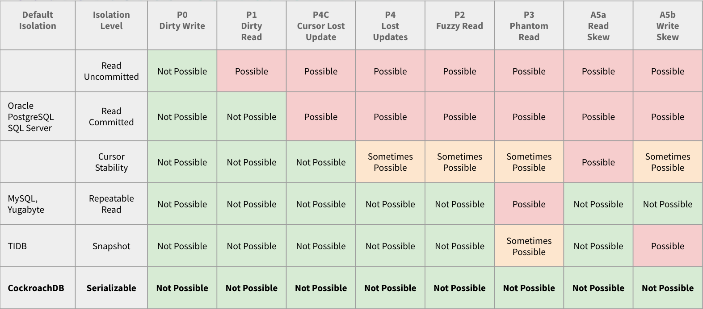

% CONCURRENCY ANOMALIES AND ISOLATION LEVELS IN RELATIONAL DATABASE
% September 10, 2022

# Concurrency
- Concurrency: multiple tasks executing in overlapping timeslices
- Race condition: different orders of interleaving steps of concurrent tasks can have different result
- Data race: concurrent tasks writing to and reading from the same data in interleaving, underterministic order
- Concurrency control: to control unwanted effects of concurrency
- In RDBMS, that usually means ACID transaction
  
# Transaction
- Transaction: a group of operations with deterministic order of executation, treated as a *single unit of work*
- ACID properties of transaction:
  - **A**tomicity
  - **C**onsistency
  - **I**solation
  - **D**urability

# The I in ACID: Isolation
- Isolation: concurrent transactions are indenpendently executed and cannot interfere with each other
- In reality, it's not always desirable to enforce *perfect isolation* of transactions
- There are different level of isolations, each provides different guarantees
- Or more precisely, *which types of anomaly they admit and forbid*

# Anomalies and isolation levels
- Anomalies: in this context, basically means unwanted concurrent data race effect
- ANSI SQL anomalies: 
  - Dirty read
  - Non repeatable (fuzzy) read
  - Phantom read
- ANSI SQL isolation levels: 
  - Uncommitted read: admits dirty read
  - Committed read: admits non-repeatable read and phantom read (forbids dirty read)
  - Repeatable read: admits phantom read (forbids dirty and non repeatable read)
  - Serializable: forbids all three anomalies
- ANSI standard has long been considered ambiguous, incomplete and leaves room for different interpretations of each isolation levels in different RDBMS

# Academic definitions
- Anomalies:
  - P0: dirty write
  - P1: dirty read
  - P2: non-repeatable read
  - P3: phantom read
  - P4: lost update
  - P4C: cursor lost update
  - A5A: read skew
  - A5B: write skew
- => As many isolation levels as there are valid combination of anomalies they admit
- Some are very practical levels that RDBMSs (and even other transactional system) widely implemented, but not defined in ANSI standard
- The standard isolation levels also have more precise definition under this framework

# Isolation levels
  

# Snapshot isolation
- Multiversion concurrency control
- Many popular DBs (Postgres among those) actually implement repeatable read as snapshot isolation, since the standard can't distinguish them
- MySQL's InnoDB engine's Read Committed level has an option to turn snapshot on

# Beyond transactional semantics: CAP and consistency levels
- ACID is about concurrent access to the same data store and doesn't imply anything in distributed context
- CAP: Consistency (not the same as the one in ACID!), Availability, Partition tolerance
- CAP theorem: choose 2
- Generalized isolation levels: consistency levels

# Consistency levels
  

# QA and discussion

# References (TBD)
[1] [Weak Consistency: A Generalized Theory and Optimistic Implementations for Distributed Transactions](https://pmg.csail.mit.edu/papers/adya-phd.pdf)
[2] [A Critique of ANSI SQL Isolation Levels](https://arxiv.org/ftp/cs/papers/0701/0701157.pdf)
[3] [Seeing is Believing: A Client-Centric Specification of Database Isolation](https://www.cs.cornell.edu/lorenzo/papers/Crooks18Seeing.pdf)
[4] https://dantheengineer.com/database-isolation-levels/
[5] http://mbukowicz.github.io/databases/2020/05/01/snapshot-isolation-in-postgresql.html
[6] https://fauna.com/blog/introduction-to-transaction-isolation-levels
[7] https://jepsen.io/consistency

# Extra level: Read atomic
- https://bartoszsypytkowski.com/ramp/
- http://muratbuffalo.blogspot.com/2022/02/ramp-tao-layering-atomic-transactions.html
