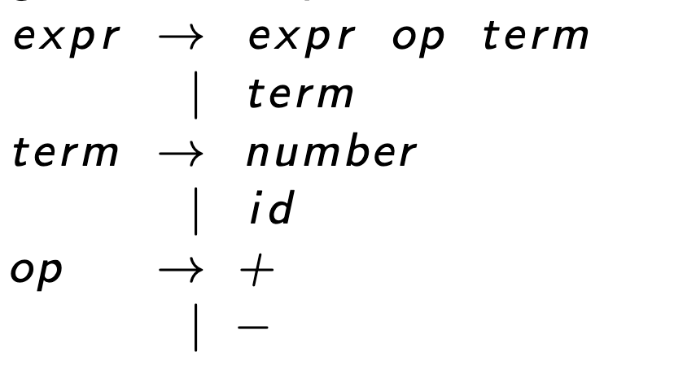
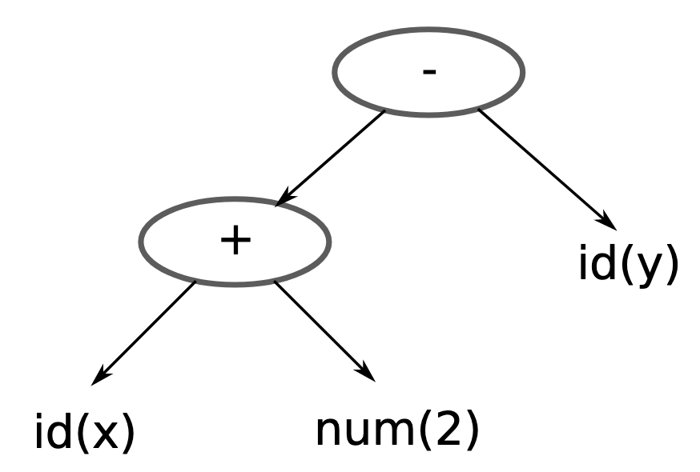
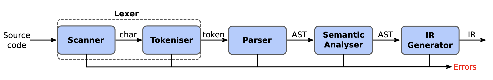

% Demystifying programming languages
% Feb 27, 2023

# What are programming languages?
- Formal languages for describing computations
- A programming language is an abstract entity specified by its syntax and semantics
- Separated from but often confused with its concrete implementation
- Implementations can be compiler, interpreter, or even language-specific hardwares

# The making of a language
- Language = syntax + semantics (+ pragmatics)
- Syntax = form
- Semantics = meaning
- Pragmatics = usage in practical context (vocabulary, idioms...)

# Syntax of a language
- Conventionally specified with Backus-Naur form (BNF)
* { width=35% height=35% }
* { width=35% height=35% }

# Syntax of a language
- Further separated into concrete syntax and abstract syntax:
  - Concrete syntax recognizes valid sentences/programs as strings
  - Abstract syntax recognizes valid sentences/programs as tree structures
  - Many to one: one concrete syntax corresponds to one abstract syntax, one abstract syntax can have many concrete syntaxes 

# Semantics of a language
- 3 approaches to formally define semantics:
  - Axiomatic semantics: logical axioms and predicates about language constructs
    -> Useful for proving programs correctness
  - Denotational semantics: model programs by mapping them to corresponding mathematical objects
    -> Useful for finding insights, connections and also proofs
  - Operational semantics: specifies evaluation rules for language constructs
    -> Most close to implementation and actual execution, and how most programmers understand "semantics" as

# Semantics of a language
- Commonly used languages usually just have informally defined semantics
- Some doesn't even have a specs at all, and defined by a *reference implementation* (like Ruby before 2011)

# Semantics of a language
- Can also be divided into static and dynamic semantics
- Loosely speaking, they're the semantics of *programs* and *processes*
- e.g. just by looking at the code you can tell a Java method may throw checked Exception, but whether it would throw or not is up to the actual execution

# How is a language implemented?
- Typically either by a compiler or an interpreter
- Usually consisted of the following phases:
- { width=100% height=100% }
- After the annotated AST/IR is obtained -> either directly interpret it, or further translate into a backend that further optimizes and ultimately translates it into the target architecture's assembly

# Lexical analysis - Lexer
- Take a program as a string -> output a stream of language's tokens
- Valid tokens are usually recognized by regular language
  -> The same "regular" in regex, with the same concatenation, alternation and replication rule
- A lexer is thus like one big regex that output tokens instead of searching for/replacing matching texts

# Parsing - Parser
- Take the above stream of tokens -> output an Abstract Syntax Tree (AST)
- Valid stream of tokens are usually recognized by context-free grammar (CFG)
- Contrast with context dependent grammar:
  - CFG: `A -> cd`
  - not CFG: `aAb -> cd`

# Parsing - Parser
- Strictly more expressive than regular language: in addition to the above rule, also allows recursive references -> possible to express tree-like structures
  -> This is why it's not a good idea in general to use regex to "parse" tree-structured documents like HTML beyond simple cases. Use a HTML parser instead!

# Parsing - Parser
- The output of the parsing phase is an AST
- Essentially, the structure of the program
- A familiar example of an AST (but for a document instead of a program) is the DOM

# Syntactic Ambiguity
- Sometimes concrete syntax isn't unambiguously defined for certain cases and can lead to multiple token types accepting the same token string, or multiple AST accepting the same expression/statement/block
  -> Re-define the concrete syntax to remove ambiguity but still corresponds to the same abstract syntax
     -> The reason why so many languages have `endif` or something similar: to make unambiguous parsing nested if clauses easier

# Static semantics - Semantic Analyzer
- Typically 2 main tasks: symbols/references table building and type inferencing and checking
- Output is an annotated AST typically with a symbol table

# Static semantics - Semantic Analyzer
- Symbols/references table building:
  - Allocation information (size, address/offset, metadata for GC etc...) for code generation phase
  - Type information for type checking phase
  - Also a deference layer to enable forward-referencing in programs

# Static semantics - Semantic Analyzer
- Symbols/references table building:
  - In intepreter context: the `Environment` table holding references recognized as the interpreter walks the AST

# Static semantics - Semantic Analyzer
- Type inferencing and checking
  - Inference type information for expressions/references
  - Checking type validity of program based of typing rules

# IR generation/interpretation
- Where implementations differ is after the annotated AST was generated

# Compilation
- For compiler, typically an intermediate representation (IR) suitable for code transformation and optimization is produced by walking the AST and generates corresponding code node by node
- The IR is typically more linear and closer to physical machine/virtual machine instructions than AST
- There can be many IR-generation phases, with each IR suitable for different transformations/optimizations
- The final output IR is usually specified by compiler backend like LLVM, and consumed by them to generated assembly instruction for targeted architecture

# Interpretation
- After the annotated AST is obtained, we can also immediately execute the program by walking the tree and execute corrsponding instruction node by node
- But usually there's also IR generations, then the IR is executed by its VM implementation instead
- JIT compilation blurs the interpretation/compilation difference even more by adaptively compiling certain "hotspot" code into native architecture instructions

%% # Case study: a Scheme interpreter
%% - Scheme
%%   - A minimalist programming language (if squeezed formal specification can fit 2 sides of an A4:
%%     https://conservatory.scheme.org/schemers/Documents/Standards/R5RS/HTML/r5rs-Z-H-10.html#%_chap_7)
%%   - Originally created by G.J. Sussman and Guy jr. Steele (The one who co-authored the Java spec) for programming language research
%%   - One of the very few industrially-used programming languages with formally defined semantics

%% # Case study: a Scheme interpreter
%% - Why Scheme?
%%   - Simple, unambiguous and easy to parse by design: surficial syntax is really close to its own AST
%%   -> Almost a cheat for parsing, but offload the burden to the interpretation/compilation phase a bit
%%   - It's actually a very popular beginner exercise in programming language theory to implement an interpreter for a subset of Scheme

